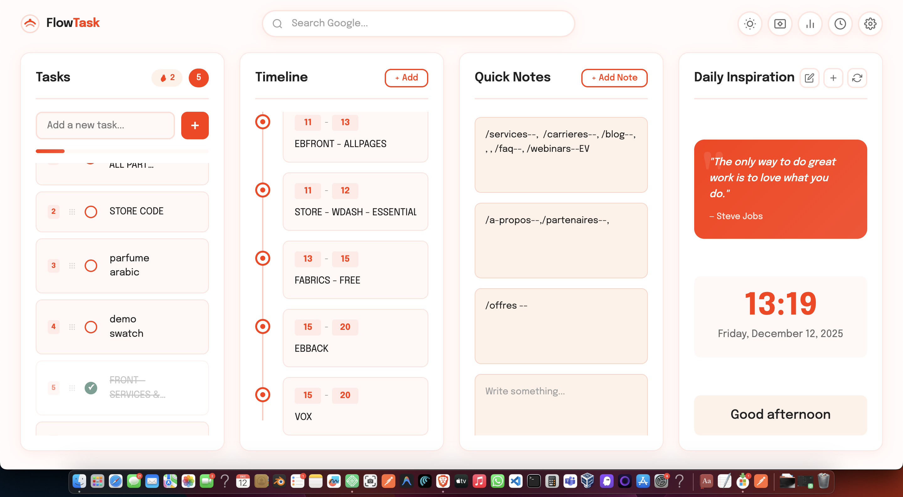

# FlowTask - Productivity Dashboard

Transform your new tab into a beautiful productivity workspace.

## Features

✅ **Smart Task Management** - Add, edit, complete, and track your daily tasks with satisfying animations

📅 **Visual Timeline** - Plan your day with an interactive, editable schedule

📝 **Quick Notes** - Capture ideas instantly with unlimited sticky notes

💡 **Custom Quotes** - Add your own inspirational quotes or use our curated collection

🌙 **Dark Mode** - Easy on the eyes with a beautiful muted purple theme

🎨 **Customizable Colors** - Personalize your dashboard with custom color schemes

📊 **Progress Tracking** - Stay motivated with completion streaks and achievements

🔄 **History & Restore** - Never lose important items - restore deleted tasks, notes, and timeline entries

🔍 **Google Search** - Quick access to Google search right from your dashboard

## Privacy First

- All data stored locally on your device
- No data collection or tracking
- No external servers
- No ads

## Installation

### From Chrome Web Store
1. Visit the [FlowTask Chrome Web Store page](#)
2. Click "Add to Chrome"
3. Open a new tab to start using FlowTask!

### Manual Installation (Developer Mode)
1. Download or clone this repository
2. Open Chrome and go to `chrome://extensions/`
3. Enable "Developer mode" (top right)
4. Click "Load unpacked"
5. Select the `flowtask-extension` folder
6. Open a new tab to see FlowTask!

## Usage

- **Tasks**: Type in the input field and press Enter or click + to add tasks
- **Timeline**: Click "+ Add" to add time blocks, edit times and titles inline
- **Notes**: Click "+ Add Note" to create new sticky notes
- **Quotes**: Use the icons to add, edit, shuffle, or delete quotes
- **Theme**: Click the sun/moon icon to toggle dark mode
- **Settings**: Click the gear icon to customize colors
- **History**: Click the clock icon to view and restore deleted items

## Keyboard Shortcuts

- `Enter` - Add new task / Save edits
- Click checkbox - Complete task
- Click any text - Edit inline

## Browser Support

- Google Chrome
- Brave Browser
- Microsoft Edge
- Opera
- Any Chromium-based browser

## Version History

### v1.0.0
- Initial release
- Task management with CRUD operations
- Visual timeline
- Sticky notes
- Custom quotes
- Dark/Light mode
- Color customization
- History & restore
- Gamification (streaks, achievements, confetti)

## License

MIT License - Feel free to modify and distribute.

## Support

If you enjoy FlowTask, please leave a review on the Chrome Web Store!

For issues or feature requests, please open an issue on GitHub.
